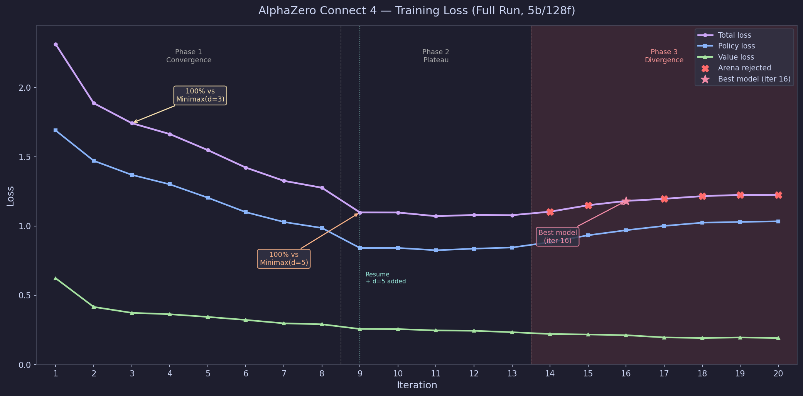

# Connect 4 — AlphaZero

An AlphaZero-style Connect 4 agent trained entirely from self-play — no human game data, no hand-crafted heuristics. Combines Monte Carlo Tree Search (MCTS) with a dual-headed residual neural network. The large model (5 ResBlocks, 128 filters) achieves 100% win rate against Minimax depth-5 by iteration 9 of 20.

**[Play it live in your browser →](https://eugeneyp.github.io/connect4-alphazero/)**

---

## How It Works

The agent uses the AlphaZero algorithm:

1. **Self-play** — the current network guides MCTS to play games against itself, generating (state, policy, value) training samples
2. **Train** — the network is updated on samples from a replay buffer using a combined MSE + cross-entropy loss
3. **Arena** — the new candidate model plays the current best; if win rate ≥ 55% it replaces it
4. Repeat

MCTS selects moves using the PUCT formula, guided by the network's policy and value heads. Dirichlet noise at the root maintains exploration during self-play.

---

## Network Architecture

Three model sizes were trained:

| Model | ResBlocks | Filters | Parameters | Config |
|-------|-----------|---------|------------|--------|
| Tiny  | 2         | 32      | ~100K      | `configs/tiny.yaml` |
| Medium | 4        | 64      | ~400K      | `configs/medium.yaml` |
| **Large** | **5** | **128** | **~1.6M** | `configs/full.yaml` |

All models share the same architecture:

```
Input: (batch, 3, 6, 7) — 3 planes: current player pieces, opponent pieces, turn indicator

Trunk:
  Conv2d(3 → filters, 3×3) → BatchNorm → ReLU
  N × Residual Block (Conv → BN → ReLU → Conv → BN → skip → ReLU)

Policy head:
  Conv2d(filters → 32, 1×1) → BN → ReLU → Flatten → Linear(1344, 7)
  Output: raw logits (illegal moves masked to -inf before softmax)

Value head:
  Conv2d(filters → 32, 1×1) → BN → ReLU → Flatten → Linear(1344, 256) → ReLU → Linear(256, 1) → Tanh
  Output: scalar in [-1, +1]
```

The board is always encoded from the current player's perspective, so the network only needs to learn one side of the game.

---

## Training Results

### Large model (5 ResBlocks, 128 filters)

- **Platform:** Google Cloud Platform — NVIDIA L4 GPU (`g2-standard-4`)
- **Iterations:** 20
- **Games per iteration:** 2000 self-play games
- **Total games:** 40,000
- **MCTS simulations per move:** 400
- **Training time:** ~48 hours

**Benchmark results (best model, 400 MCTS sims):**

| Opponent | Win rate |
|----------|----------|
| Random | 100% |
| Minimax depth 1 | 100% |
| Minimax depth 3 | 100% |
| Minimax depth 5 | 100% |
| Minimax depth 7 | 100% |
| Minimax depth 9 | 100% |

### Medium model (4 ResBlocks, 64 filters)

- **Platform:** Kaggle — NVIDIA P100 GPU
- **Iterations:** 12
- **Games per iteration:** 800 self-play games
- **Total games:** 9,600
- **MCTS simulations per move:** 200

### Training loss — Large model



Three distinct phases are visible:
- **Phase 1 (iters 1–8):** Rapid convergence — total loss drops from 2.31 to 1.28
- **Phase 2 (iters 9–13):** Plateau — losses flatten, model consolidates, beats Minimax(d=5) at 100%
- **Phase 3 (iters 14–20):** Divergence — policy loss rises as self-play games become harder and more contested (expected AlphaZero behaviour); arena starts rejecting most candidates; value loss continues improving

The best model is from **iteration 16** — the last accepted checkpoint, which defeated every subsequent challenger through iteration 20.

---

## Repository Structure

```
connect4-alphazero/
├── src/
│   ├── game/          # Bitboard Connect 4 engine
│   ├── neural_net/    # ResNet dual-head model
│   ├── mcts/          # MCTS + BatchedMCTS (GPU-batched)
│   ├── training/      # Self-play, trainer, arena, coach, replay buffer
│   ├── agents/        # Random, Minimax, MCTS, AlphaZero agents
│   └── export/        # ONNX export + Kaggle submission agent
├── configs/           # YAML training configs (tiny / medium / full)
├── scripts/           # train.py, evaluate.py, export_onnx.py, kaggle_submit.py
├── tests/             # pytest test suite (~170 tests)
├── web/               # Browser UI (Canvas + ONNX Runtime Web)
└── CLOUD_TRAINING.md  # Full cloud training guide
```

---

## Setup

**Requirements:** Python 3.11+, PyTorch 2.0+

```bash
git clone https://github.com/eugeneyp/connect4-alphazero.git
cd connect4-alphazero
pip install .
```

For development (includes pytest, coverage):
```bash
pip install ".[dev]"
```

**Run tests:**
```bash
pytest tests/ -v
```

---

## Local Training

```bash
# Tiny config — fast end-to-end test (~5 min, CPU)
python scripts/train.py --config configs/tiny.yaml

# Medium config — meaningful training run
python scripts/train.py --config configs/medium.yaml

# Resume from a checkpoint
python scripts/train.py --config configs/medium.yaml \
  --resume checkpoints/checkpoint_iter_005.pt
```

Checkpoints are saved to `checkpoints/` after every iteration. `checkpoints/best_model.pt` always holds the strongest accepted model.

---

## Cloud Training

See **[CLOUD_TRAINING.md](CLOUD_TRAINING.md)** for full step-by-step instructions. Summary below.

### Kaggle (Free — P100 GPU)

Kaggle's background runner gives ~9 hours per session. With `medium_v2.yaml` (batched MCTS, `mcts_batch_size: 32`) you get ~25 min/iteration — fitting ~18 iterations per session.

**Cell 1 — Clone and install:**
```python
!git clone https://github.com/eugeneyp/connect4-alphazero.git /kaggle/working/connect4-alphazero
!pip install /kaggle/working/connect4-alphazero -q
```

**Cell 2 — Train:**
```python
%cd /kaggle/working/connect4-alphazero
!python3 scripts/train.py --config configs/medium_v2.yaml \
  2>&1 | tee /kaggle/working/training.log
```

Go to **Settings → Accelerator → GPU P100** and **Save & Run All**. Checkpoints are saved to `/kaggle/working/checkpoints/` and persist in the Output tab.

**Resuming after the 9-hour session limit:** publish the output as a Kaggle dataset, add it to your next notebook, then:
```python
import glob
checkpoints = sorted(glob.glob('/kaggle/input/YOUR_DATASET/connect4-alphazero/checkpoints/checkpoint_iter_*.pt'))
latest = checkpoints[-1]

%cd /kaggle/working/connect4-alphazero
!python3 scripts/train.py --config configs/medium_v2.yaml --resume {latest} \
  2>&1 | tee /kaggle/working/training.log
```

### Google Cloud Platform (L4 GPU — recommended for full run)

**One-time setup:**
```bash
gcloud auth login
gcloud config set project YOUR_PROJECT_ID
gcloud services enable compute.googleapis.com
```

**Find the current PyTorch image:**
```bash
gcloud compute images list --project=deeplearning-platform-release --no-standard-images --filter="family~pytorch" --format="table(family,name,creationTimestamp)" --sort-by="~creationTimestamp" | head -5
```

**Create the VM** (L4 GPU, ~$0.90/hr):
```bash
gcloud compute instances create connect4-fullrun \
  --zone=us-central1-b \
  --machine-type=g2-standard-4 \
  --image-family=IMAGE_FAMILY \
  --image-project=deeplearning-platform-release \
  --maintenance-policy=TERMINATE \
  --restart-on-failure \
  --boot-disk-size=100GB \
  --metadata=install-nvidia-driver=True
```

Replace `IMAGE_FAMILY` with the result from the image lookup step (e.g. `pytorch-2-7-cu128-ubuntu-2204-nvidia-570`).

**SSH in, clone, and run:**
```bash
gcloud compute ssh connect4-fullrun --zone=us-central1-b
```

On the VM:
```bash
git clone https://github.com/eugeneyp/connect4-alphazero.git && cd connect4-alphazero
pip install . -q && mkdir -p logs
tmux new -s fullrun
python3 scripts/train.py --config configs/full.yaml 2>&1 | tee logs/full_run.log
```

Detach tmux: `Ctrl+B` then `D`. Training runs even after you close SSH.

**Download results when done:**
```bash
gcloud compute scp --recurse connect4-fullrun:~/connect4-alphazero/checkpoints/ ./checkpoints/ --zone=us-central1-b
gcloud compute scp connect4-fullrun:~/connect4-alphazero/logs/full_run.log ./logs/ --zone=us-central1-b
```

**Stop the VM to avoid charges:**
```bash
gcloud compute instances stop connect4-fullrun --zone=us-central1-b
```

**Config reference:**

| Config | Model | Sims | Games/iter | GPU batch | Time/iter | Platform |
|--------|-------|------|------------|-----------|-----------|----------|
| `tiny.yaml` | 2b/32f | 50 | 100 | 1 | ~5 min | Local CPU |
| `medium.yaml` | 4b/64f | 200 | 800 | 1 | ~100 min | Kaggle P100 (serial) |
| `medium_v2.yaml` | 4b/64f | 300 | 800 | 32 | ~25 min | **Kaggle P100 (recommended)** |
| `full.yaml` | 5b/128f | 400 | 2000 | 32 | ~2h | **GCP L4** |

---

## Evaluation

```bash
# Benchmark against classical agents (100 games, 400 sims)
python scripts/evaluate.py \
  --checkpoint checkpoints/best_model.pt \
  --num-games 50 \
  --mcts-sims 400 \
  --depth 1 3 5 7

# AlphaZero only vs specific depths (no Random/MCTS noise)
python scripts/evaluate.py \
  --checkpoint checkpoints/best_model.pt \
  --depth 7 9 \
  --num-games 10 \
  --mcts-sims 400 \
  --az-only
```

---

## Kaggle Submission

The agent is submitted as a `tar.gz` archive containing a pure-NumPy ResNet + inline MCTS (no PyTorch dependency in the submission sandbox).

```bash
# Build submission archive
python scripts/kaggle_submit.py \
  --checkpoint checkpoints/best_model.pt \
  --output submission/ \
  --tar

# Test locally
# Open notebooks/kaggle_local_test.ipynb

# Upload submission/submission.tar.gz to kaggle.com/c/connectx → Submit Predictions
```

---

## Acknowledgements

### Papers

- **Silver et al. (2017)** — [*Mastering the Game of Go without Human Knowledge*](https://www.nature.com/articles/nature24270) (AlphaGo Zero) — the direct template for this project
- **Silver et al. (2018)** — [*Mastering Chess and Shogi by Self-Play with a General Reinforcement Learning Algorithm*](https://arxiv.org/abs/1712.01815) (AlphaZero) — generalization to multiple games
- **Gupta (2022)** — [*Reinforcement Learning for ConnectX*](https://arxiv.org/pdf/2210.08263) — AlphaZero applied to Kaggle Connect-X, reached rank 9/225

### Books

- **Dürr & Mayer** — *Neural Networks for Chess* — the clearest explanation of how AlphaZero works that I found, including MCTS integration, network architecture, and training loop details

### Open Source References

- [suragnair/alpha-zero-general](https://github.com/suragnair/alpha-zero-general) — most widely referenced general AlphaZero implementation
- [bhansconnect/fast-alphazero-general](https://github.com/bhansconnect/fast-alphazero-general) — Cython-optimized fork
- [AlphaZero.jl Connect 4 tutorial](https://jonathan-laurent.github.io/AlphaZero.jl/stable/tutorial/connect_four/) — thorough benchmarks vs perfect solver
- [David Foster — "How to Build Your Own AlphaZero AI"](https://medium.com/applied-data-science/how-to-build-your-own-alphazero-ai-using-python-and-keras-7f664945c188) — accessible step-by-step walkthrough

### Connect 4 Theory

- [John Tromp's Connect Four Playground](https://tromp.github.io/c4/c4.html) — perfect solver; Connect 4 was solved in 1988 (first player wins with optimal play from the centre column)
